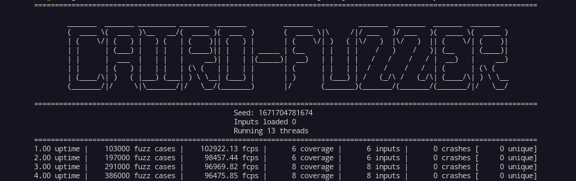

# Cairo-Fuzzer -- Cairo Smart Contract Fuzzer

Release version 1.0 
Developped and maintained by [@FuzzingLabs](https://github.com/FuzzingLabs)

## Description:

Cairo-fuzzer is a tool designed for smart contract developers to test the security. It can be used as an independent tool or as a library.

## Features:

<p align="center">
	
</p>

- Run cairo contract
- Run cairo contract with hints implemented in cairo-rs
- Replayer of fuzzing corpus
- Minimizer of fuzzing corpus
- Load old corpus
- Handle multiple arguments
- Load a folder of inputs/crashes files
- CLI
- Run Cairo-fuzzer using a config file instead of CLI
- Workspace architecture

## Usage:
```
cargo run --release -- --cores 4 --contract tests/fuzzinglabs.json --function "test_symbolic_execution"
```

## CMDLINE (--help):

```
Usage: cairo-fuzzer [OPTIONS]

Options:
      --cores <CORES>              Set the number of threads to run [default: 1]
      --contract <CONTRACT>        Set the path of the JSON artifact to load [default: ]
      --function <FUNCTION>        Set the function to fuzz [default: ]
      --workspace <WORKSPACE>      Workspace of the fuzzer [default: fuzzer_workspace]
      --inputfolder <INPUTFOLDER>  Path to the inputs folder to load [default: ]
      --crashfolder <CRASHFOLDER>  Path to the crashes folder to load [default: ]
      --inputfile <INPUTFILE>      Path to the inputs file to load [default: ]
      --crashfile <CRASHFILE>      Path to the crashes file to load [default: ]
      --logs                       Enable fuzzer logs in file
      --seed <SEED>                Set a custom seed (only applicable for 1 core run)
      --run-time <RUN_TIME>        Number of seconds this fuzzing session will last
      --config <CONFIG>            Load config file
      --replay                     Replay the corpus folder
      --minimizer                  Minimize Corpora
  -h, --help                       Print help information
```

# F.A.Q

## How to find a Cairo/Starknet compilation artifact (json file)?

Cairo-Fuzzer supports cairo compilation artifact (json file) generated after compilation using `cairo-compile`.

## How to run the tests?

```
cargo test
```

# License

Cairo-Fuzzer is licensed and distributed under the AGPLv3 license. Contact us if you're looking for an exception to the terms.