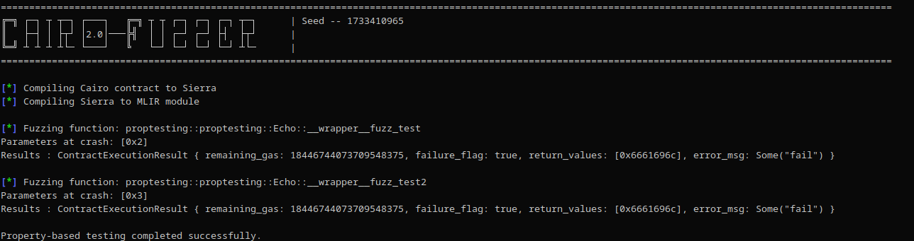

## Cairo Native Fuzzer

Cairo Native Fuzzer is a rewrite of the Cairo Fuzzer based on [Cairo native from Lambdaclass](https://github.com/lambdaclass/cairo_native) developed to enhance fuzzer execution speed.

<p align="center">
	
</p>

### Installation 

- Install LLVM 19.
- Run `insall.sh`.

#### Print the functions prototypes

```sh
## With a cairo program
cargo run -- --program-path examples/fuzzinglabs.cairo --analyze

# With a Sierra program
cargo run -- --sierra-program ./examples/sierra/zklend_fuzzing.json --analyze
```

#### Run the fuzzer

```sh
cargo run -- --program-path ./examples/cairo/echo.cairo --entry-point echo::echo::Echo::__wrapper__echo_felt 

## Use a seed
cargo run -- --program-path ./examples/cairo/echo.cairo --entry-point echo::echo::Echo::__wrapper__echo_felt  --seed 42

## With a sierra input file
cargo run -- --sierra-program ./examples/sierra/zklend_fuzzing.json --entry-point zklend::fuzzing::Fuzzing::__wrapper__fuzz_scaled_down_amount --seed 1739662178
```

#### Property testing 

You can define functions that will be fuzzed automatically by prefixing their name with `fuzz_` : 

```rs
#[starknet::contract]
mod Echo {
    #[storage]
    struct Storage {
        balance: felt252,
    }

    #[constructor]
    fn constructor(ref self: ContractState, initial_balance: felt252) {
        self.balance.write(initial_balance);
    }

    #[external(v0)]
    fn fuzz_test(ref self: ContractState, value: felt252) -> felt252 {
        assert(value != 2, 'fail');
        value
    }

    #[external(v0)]
    fn fuzz_test2(ref self: ContractState, value: u32) -> u32 {
        assert(value != 3, 'fail');
        value
    }
}
```

Then run the `cairo-fuzzer` with the `--proptesting` flag : 

```sh
cargo run -- --program-path examples/cairo/proptesting.cairo --proptesting
```

<p align="center">
	
</p>


### Roadmap 

- [x] Implement the Cairo Native runner
- [x] Implement the fuzzer based on Cairo Native runner
- [x] Import existing mutator from the cairo-fuzzer
- [x] Property testing
