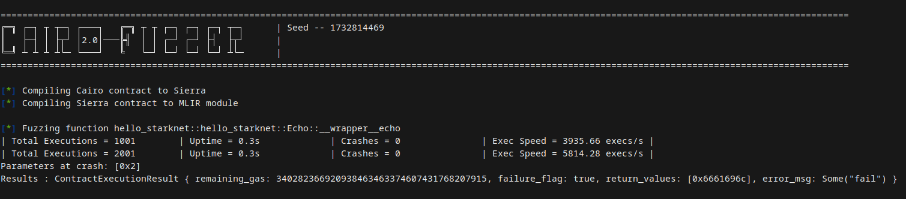

## Cairo Native Fuzzer

Cairo Native Fuzzer is a rewrite of the Cairo Fuzzer based on [Cairo native from Lambdaclass](https://github.com/lambdaclass/cairo_native) developed to enhance fuzzer execution speed.

<p align="center">
	
</p>

### Installation 

- Install LLVM 19.
- Run `insall.sh`.

#### Print the functions prototypes

```sh
cargo run -- --program-path examples/fuzzinglabs.cairo --analyze
```

#### Run the fuzzer

```sh
cargo run -- --program-path examples/hello_starknet.cairo --entry-point hello_starknet::hello_starknet::Echo::__wrapper__echo

## Use a seed
cargo run -- --program-path examples/hello_starknet.cairo --entry-point hello_starknet::hello_starknet::Echo::__wrapper__echo --seed 42

## Select the number of cores
cargo run -- --program-path examples/hello_starknet.cairo --entry-point hello_starknet::hello_starknet::Echo::__wrapper__echo --cores 8
```

### Roadmap 

### Step 1 : Create a basic fuzzer based on Cairo Native : 
- [x] Implement the Cairo Native runner
- [x] Implement the fuzzer based on Cairo Native runner
- [x] Import existing mutator from the cairo-fuzzer

### Step 2 : Integrate existing cairo-fuzzer features into Cairo Native fuzzer : 
- [x] Multithreading
- [ ] Support config files
- [ ] Property testing
