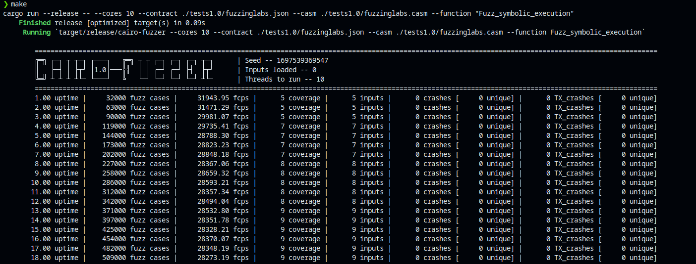
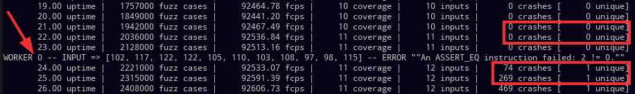

<p align="center">
  
</p>

# How to fuzz a Cairo/Starknet Smart Contract

We will take this Smart Contract as an example:
```rust
use starknet::{
    Store, SyscallResult, StorageBaseAddress, storage_read_syscall, storage_write_syscall,
    storage_address_from_base_and_offset
};
use integer::{
    U128IntoFelt252, Felt252IntoU256, Felt252TryIntoU64, U256TryIntoFelt252, u256_from_felt252
};


#[starknet::contract]
mod test_contract {
    #[storage]
    struct Storage {
        bal:u8
    }
 #[external(v0)]
    fn Fuzz_symbolic_execution(
ref self: ContractState,
    f: felt252,
    u: felt252,
    z: u16,
    z2: u32,
    i: u64,
    n: u128,
    g: u128,
    l: u128,
    a: felt252,
    b: felt252,
    s: u8,
    ) {
        if (f == 'f') {
            if (u == 'u') {
                if (z == 'z') {
                    if (z2 == 'z') {
                        if (i == 'i') {
                            if (n == 'n') {
                                if (g == 'g') {
                                    if (l == 'l') {
                                        if (a == 'a') {
                                            if (b == 'b') {
                                                if (s == 's') {
                                                    assert(1==0 , '!(f & t)');
                                                }
                                            }
                                        }
                                    }
                                }
                            }
                        }
                    }
                }
            }
        }
        return ();
    }
}
```

## Compile contract:
- Follow these [steps](https://github.com/starkware-libs/cairo#getting-started) to setup cairo in your environment
- Next, create the file `fuzzinglabs.cairo` that will contain the code above.
- run `cargo run --bin starknet-compile -- --single-file /path/to/fuzzinglabs.cairo /path/to/fuzzinglabs.json`
- then `cargo run --bin starknet-sierra-compile -- /path/to/fuzzinglabs.json /path/to/fuzzinglabs.casm`

## Analyze the code:
Looking at the code, we deduce that the function we want to fuzz is `Fuzz_symbolic_execution`, the goal is to find the good arguments to reach the `assert 1 == 0`.

## Running the fuzzer:
The simple command line to fuzz the function `Fuzz_symbolic_execution` of the `fuzzinglabs.cairo` contract is:

```sh
cargo run --release -- --cores 11 --contract ./tests1.0/fuzzinglabs.json --casm ./tests1.0/fuzzinglabs.casm --target-function "Fuzz_symbolic_execution" 
```



## Detecting the crash:
Once the fuzzer will find a unique crash you will have something like this:



You can see that the good input to reach the `assert 0 = 2` is `[102, 117, 122, 122, 105, 110, 103, 108, 97, 98, 115]`.
In ascii we get `[f,u,z,z,i,n,g,l,a,b,s]`.

So running the function `Fuzz_symbolic_execution` with `(102, 117, 122, 122, 105, 110, 103, 108, 97, 98, 115)` will lead to the assert.

## Optimize the fuzzing

You can optimize the fuzzing using the multiple option of Cairo-Fuzzer.
See [this documention](Usage.md) to get more information.